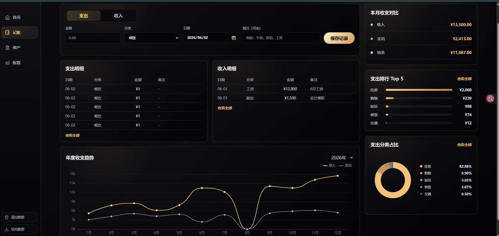
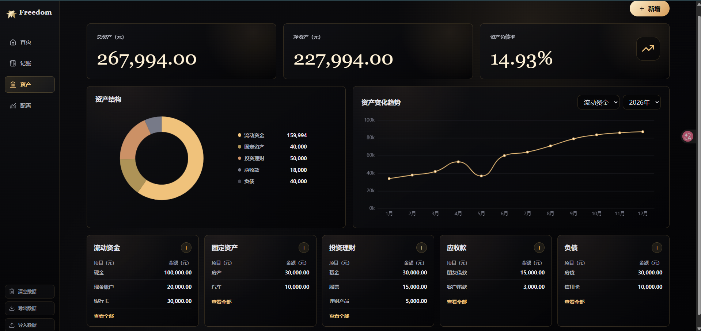
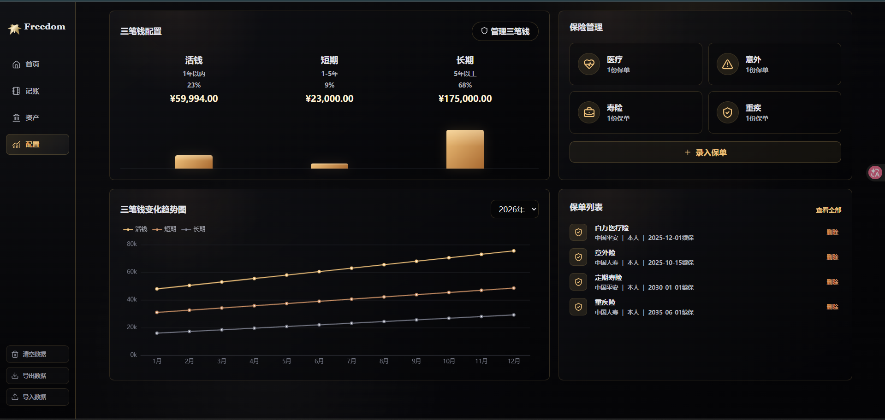

# Freedom


Freedom 是一个面向上班族的个人财务助手网站，用于记录收入支出、查看资产负债、配置三笔钱和维护保单信息。项目采用 Vue 3 + Vite 开发，数据默认保存在浏览器 LocalStorage，适合作为个人财务管理产品原型和前端作品集展示项目。

很多人在有稳定收入和一定积蓄后，会开始关注储蓄、投资、保险和资产配置，但常见问题是：

- 不清楚钱花在哪里
- 不清楚自己有多少资产和负债
- 不知道资金是否合理分配
- 保险信息分散，缺少统一记录

Freedom 希望用一个简单、直观的网页工具，帮助用户看清自己的个人财务状况。

## Preview

本地运行后访问：

```bash
http://localhost:5173/
```

### Screenshots

| 首页 | 记账页 |
| --- | --- |
|  |  |

| 资产页 | 配置页 |
| --- | --- |
|  |  |

## Features

- 首页：品牌化首屏、财务规划说明、黑金视觉风格
- 记账：收入 / 支出录入、月度筛选、年度趋势、分类排行、分类占比
- 资产：资产 / 负债录入、资产结构、资产趋势、分类明细
- 配置：三笔钱配置、保险分类统计、保单录入与管理
- 数据管理：本地数据清空、JSON 导出、JSON 导入
- 表单校验：金额、日期、分类、备注长度等基础校验
- 弹窗交互：查看全部、删除确认、新增 / 管理 / 录入弹窗统一
- 本地持久化：使用 LocalStorage 保存记账、资产、快照和保单数据

## Tech Stack

| Area | Technology |
| --- | --- |
| Framework | Vue 3 |
| Build Tool | Vite |
| Charts | ECharts |
| Icons | lucide-vue-next |
| Storage | LocalStorage |
| Language | JavaScript |
| Styling | CSS |
| Deployment | Netlify-ready |

## Project Structure

```text
Freedom/
├── src/
│   ├── App.vue
│   ├── main.js
│   ├── styles.css
│   ├── pages/
│   │   ├── HomePage.vue
│   │   ├── LedgerPage.vue
│   │   ├── AssetsPage.vue
│   │   └── ConfigPage.vue
│   └── utils/
│       ├── financeCalc.js
│       ├── assetCalc.js
│       ├── configCalc.js
│       ├── storage.js
│       ├── validators.js
│       └── dataPortability.js
├── tests/
├── index.html
├── package.json
└── vite.config.js
```

## Getting Started

### Requirements

- Node.js 18+
- npm

### Install

```bash
npm install
```

### Development

```bash
npm run dev
```

### Build

```bash
npm run build
```

### Preview

```bash
npm run preview
```

## Testing

当前测试文件位于 `tests/` 目录，可直接使用 Node.js 运行：

```bash
node tests/financeCalc.test.mjs
node tests/assetCalc.test.mjs
node tests/configCalc.test.mjs
node tests/validators.test.mjs
node tests/dataPortability.test.mjs
```

## Data Model

项目核心数据保存在浏览器 LocalStorage：

| Key | Description |
| --- | --- |
| `freedom_ledger_records` | 收支记录 |
| `freedom_assets` | 资产与负债 |
| `freedom_asset_snapshots` | 资产快照 |
| `freedom_policies` | 保单数据 |
| `freedom_data_cleared` | 清空数据状态 |

## Privacy

Freedom 当前版本不做登录、不做后端、不接入第三方财务接口，所有数据默认保存在用户本地浏览器 LocalStorage 中，不会上传服务器。

需要注意：

- 换浏览器后数据不会自动同步
- 换设备后数据不会自动同步
- 清理浏览器缓存可能导致数据丢失
- 可以通过 JSON 导入 / 导出进行备份和迁移

## Core Modules

- `financeCalc.js`：月度收支汇总、支出排行、分类占比、年度趋势
- `assetCalc.js`：资产总览、资产分类汇总、资产趋势
- `configCalc.js`：三笔钱汇总、三笔钱趋势、保险分类统计
- `storage.js`：LocalStorage 读写、示例数据、导入导出、删除逻辑
- `validators.js`：记账、资产、保单表单校验
- `dataPortability.js`：备份文件生成与导入格式校验

## Product Scope

Freedom 当前定位为个人财务管理 MVP，重点覆盖：

- 日常收支记录
- 资产负债可视化
- 现金 / 短期 / 长期三笔钱配置
- 家庭保单信息管理
- 本地数据备份与恢复

暂未包含账号系统、云端同步、多人协作、银行接口接入等商业化功能。

## Roadmap

- 增加记账记录编辑能力
- 增加数据备份提醒
- 增加更细的资产账户管理
- 增加保险续保提醒
- 增加更完整的移动端适配
- 增加全局 Toast / 动效反馈
- 增加预算目标与月度复盘
- 增加更完整的数据筛选和搜索
- 增加部署版本与在线演示地址
- 后续根据需要考虑 AI 财务总结功能

## License

This project is licensed under the MIT License.
